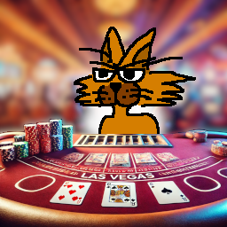

## LASVEGAS JACK

ラスベガスに行ってブラックジャックで大儲け！…というわけで  
1983年に作ったトランプゲームのブラックジャックです。

あなたとコンピュータが「サシ」で勝負します。
勝負するゲームは BLACK JACK です。
持ち金は、1000ドル（1983年時点で 1ドル=231.5円！）あります。

## 動画URL

https://youtu.be/PenTHfZ7E0g

### 動作条件

- メモリは16KB/32KBどちらでも大丈夫です
- ページ数は1/2どちらでも大丈夫です

### プログラムの起動方法

起動までの手順はこんな感じです。

- カセットケーブルの白をwav再生デバイスと接続します
- PC6001実機を起動します
- How Many Pages? は[RETURN]でオッケーです。
- ***CLOAD***コマンドを実行します
- wav再生デバイスで`P60_L-JACK_edit2.wav`を再生します
  - `L-JACK` という名前で読み込まれます
- ***RUN***コマンドでプログラムを実行します

### プレイ方法

タイトル画面で`SPACE`キーを押すと始まります。  
（ゴメンナサイ、キーの反応が悪いです😅）  

先ずはガードのシャッフルが行われます。  
シャッフルが終わると、あなたとコンピュータに１枚カードが配られます。

数字札２～１０はそのままの数値で  
絵札（Ｊ，Ｑ，Ｋ）は１０、  
Ａは１１または１の都合のいい方となります。

何点賭けるか訊かれますので、賭け金を入力し`RETURN`キーを押します。

するともう１枚配られ、もう１枚引くか訊かれますので  
引くなら`y`キー、引かないなら`n`キーを押します。

`y`キーを押すと、もう１枚配られ、再度もう１枚引くか訊かれます。  
あなたは２１を超えないように手札の合計を２１に近づけ  
コンピュータを上回るようにします。

`n`キーを押すと、コンピュータがカードを引きます。

コンピュータが引き終わると勝負判定が行われ  
あなたが勝った場合は持ち金に賭け金が払われます。  
あなたが負けた場合は持ち金から賭け金が没収されます。  
BLACK JACK （手持ちの札の合計が21）になると掛け金は２倍になります。

