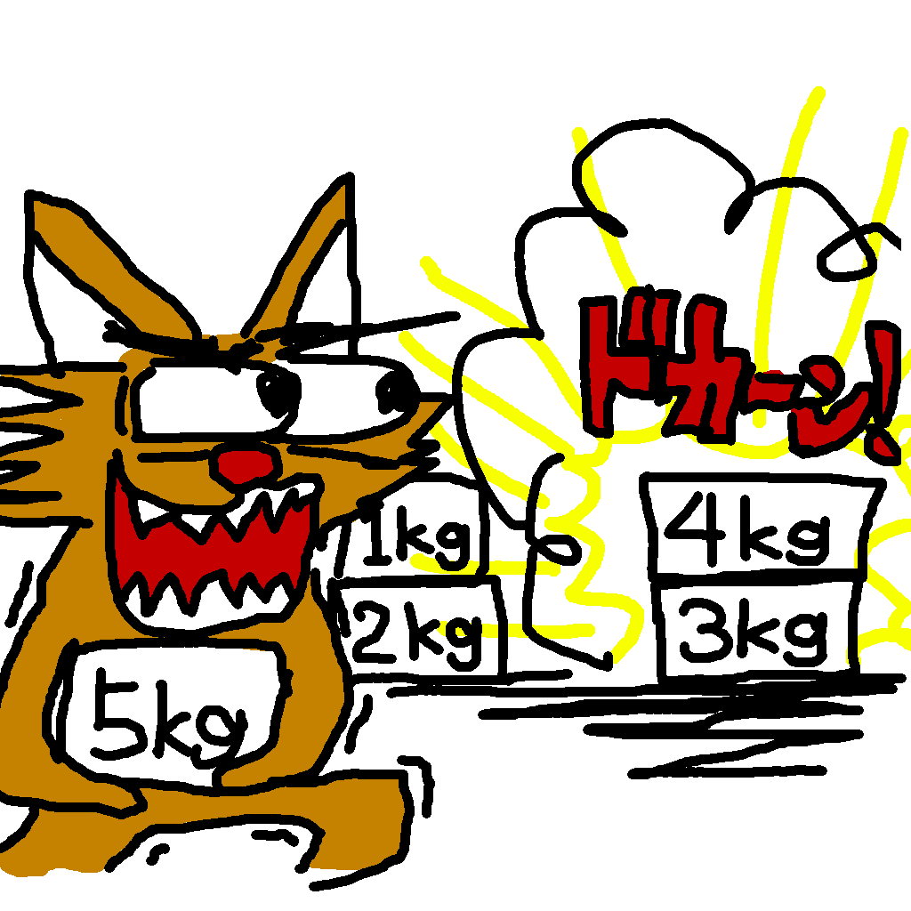
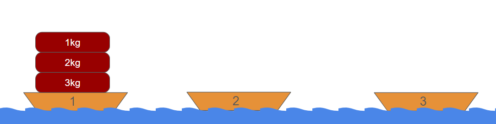
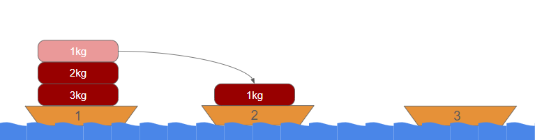
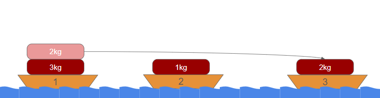
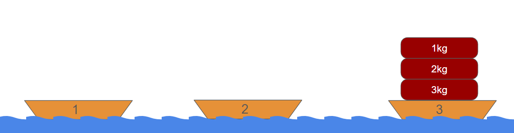
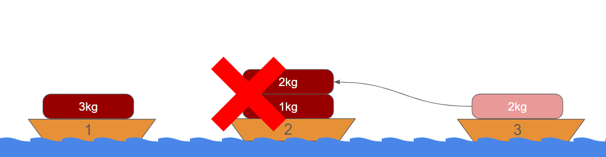
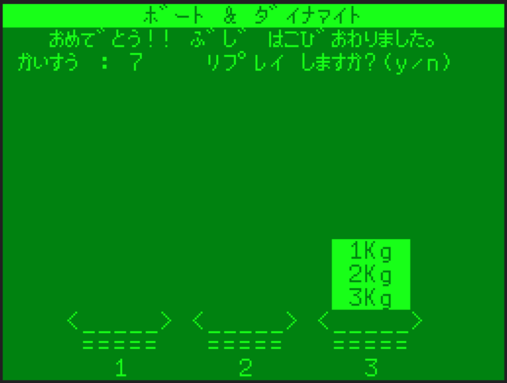

## ボートアンドダイナマイトのドキュメント

## 動画URL

https://youtu.be/MWzhimM_9zM

### 動作条件

- メモリは16KB/32KBどちらでも大丈夫です
- ページ数は1/2どちらでも大丈夫です

### プログラムの起動方法

起動までの手順はこんな感じです。

- カセットケーブルの白をwav再生デバイスと接続します
- PC6001実機を起動します
- How Many Pages? は[RETURN]でオッケーです。
- ***CLOAD***コマンドを実行します
- wav再生デバイスで`P6_BOAT_AND_DYNAMITE_16k_p1.WAV`を再生します
  - `B&D` という名前で読み込まれます
- ***RUN***コマンドでプログラムを実行します

### ルール

左から順に１，２，３の番号が振られている３つのボートがありまして、最初１番目のボートにダイナマイトが下から重い順に並んでいます。

これを１度に１つずつ移動して…

３番目のボートにダイナマイトを全て移動すれば成功となります。

ただし、軽いダイナマイトのすぐ上に重いダイナマイトを置くと爆発してゲームオーバーになります。例えば以下の図のように１ｋｇのダイナマイトの上に２ｋｇのダイナマイトを置くと爆発します。

### 操作方法

プログラムを実行すると、まず移動するダイナマイトの数を訊いてきますので、３～１０までの数字を入力して`RETURN`を押してください。

「どこから　どこへ　うつしますか？」と訊かれるので、移動元のボート番号、カンマ、移動先のボード番号の順に入力し`RETURN`を押してください。例えば、１番目のボートの１ｋｇのダイナマイトを２番目のボートに移動するには`1` `,` `2` `RETURN` と入力します。

全てのダイナマイトを３番目のボートに移動したら成功となります。

