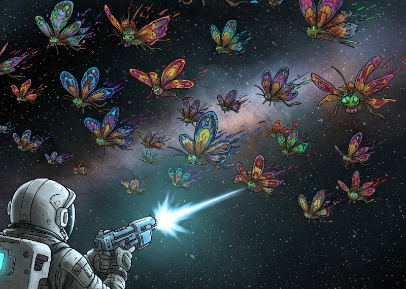
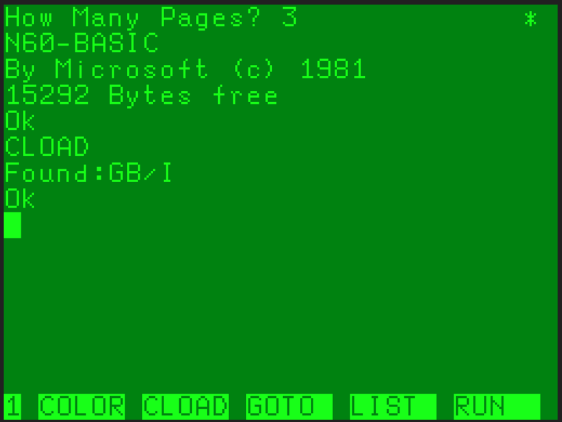
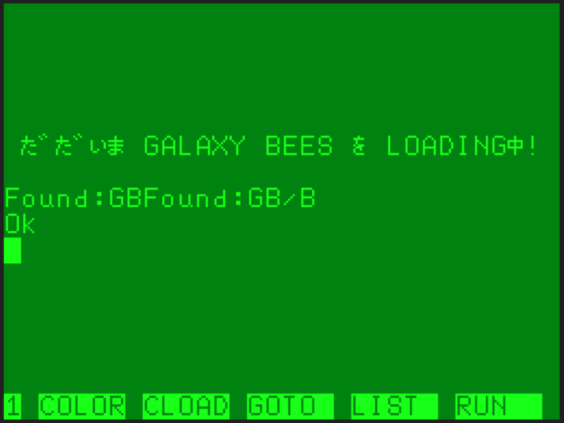
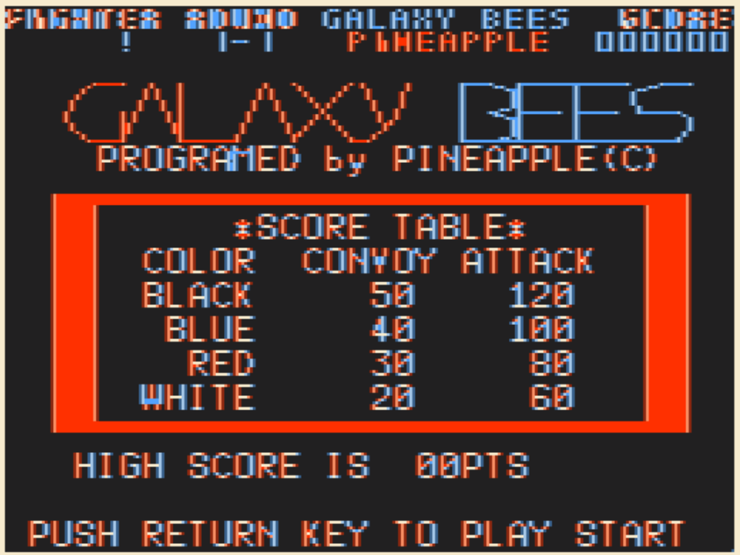
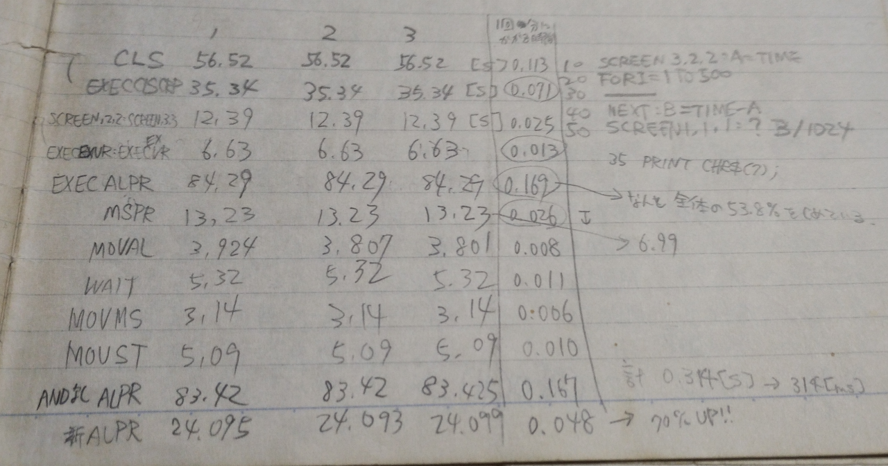

# GALAXY BEES

※30年前に作ったゲームのドキュメントの挿絵をAIに描かせるってなんかスゴイよね…😱

## もくじ

- [GALAXY BEES](#galaxy-bees)
	- [もくじ](#もくじ)
	- [動画URL](#動画url)
	- [動作条件](#動作条件)
	- [プログラムの起動方法](#プログラムの起動方法)
	- [タイトル画面](#タイトル画面)
	- [あそびかた](#あそびかた)
	- [よもやま話](#よもやま話)

## 動画URL

https://youtu.be/PpR7dJhvrDI

## 動作条件

- メモリは32KBです。
- ページ数は3です。

## プログラムの起動方法

プログラムは３つあります。  
１つ目（PC60_GB_1_I.wav - GB/I）がマシン語とBASICのローダー(IPL)で  
２つ目（PC60_GB_2_M_edit.wav - GB）がマシン語部分、  
３つ目（PC60_GB_3_B_edit.wav - GB/B）がBASICのメインプログラムです。

起動までの手順はこんな感じ。

- カセットケーブルの白をwav再生デバイスと接続します
- PC6001（無印）実機にROMRAMカートリッジを挿して起動します （mkII以降はよくわからないのでうまいことやってください😅）
- How Many Pages? は`3`を指定してください
- ***CLOAD***コマンドを実行します
- wav再生デバイスで`PC60_GB_1_I.wav`を再生します
  - `GB/I` という名前で読み込まれます 

- ***RUN***コマンドでプログラムを実行します
  - すぐに次のプログラム読み込みが開始されます
- wav再生デバイスで`PC60_GB_2_M_edit.wav`を再生します
  - `GB` という名前で読み込まれます
  - 読み込みが完了すると、引き続きBASICのプログラムをロードします
- wav再生デバイスで`PC60_GB_3_B_edit.wav`を再生します
  - `GB/B` という名前で読み込まれます 
- ***RUN***コマンドでプログラムを実行します
- ジョイスティックを使うか？と訊かれるので使用するなら'y'しないなら'n'を入力します

## タイトル画面

タイトル画面の時に `RETURN`キーを押すとゲームが始まります。

## あそびかた

画面下部のプレイヤーをカーソルキーの左右で操作し、画面上部に隊列を組む蝶型エイリアンを`SPACE`キーで発射するショットを当てて倒していきます。

エイリアンは隊列から離れて攻撃してきます。整列中より攻撃中のエイリアンのほうが
点が高くなります。

プレイヤーが発射できるショットは画面上に２つなので、弾切れに注意！

エイリアンを全て撃破すると１ステージクリアとなります。

プレイヤーにエイリアンの放つビームやエイリアン本体が当たってしまうと１ミスです。

## よもやま話

これを作ったのは高校の時なんすけど、就職に悩む時期でした。

あっしとしてはゲーム作って給料が貰える仕事があったらいいなあと思っていたんだけど、1985年という時期はまだゲームを作る会社みたいなのが一般社会には浸透してなくて、しかも田舎だったので「なに寝言みたいなこと言ってるんだ」みたいな感じでした。

ゲームソフト作ってる会社に自分の作品として持っていってアピールしたほうがいいかな？と思いこれを作ったような気がします。結局、普通のソフトウェア開発会社に面接になりましたけど…。

このゲーム、雑誌I/OでT&Eソフトさんのピラミッド、タワーパニック、マリンシューター…などでやっていたページを２枚使って切り換えるってのをやっていて、ちょっとあっしもやってみたいという気持ちがあったと思います。やってよかった。勉強になりました。

開発ノートをぺらぺらと見てたけど、処理速度厳しかったのかな？なにやら処理速度の検証みたいなのしてますな😅

親友のTORAにも開発を手伝って貰ったような気がします。ありがとう！

