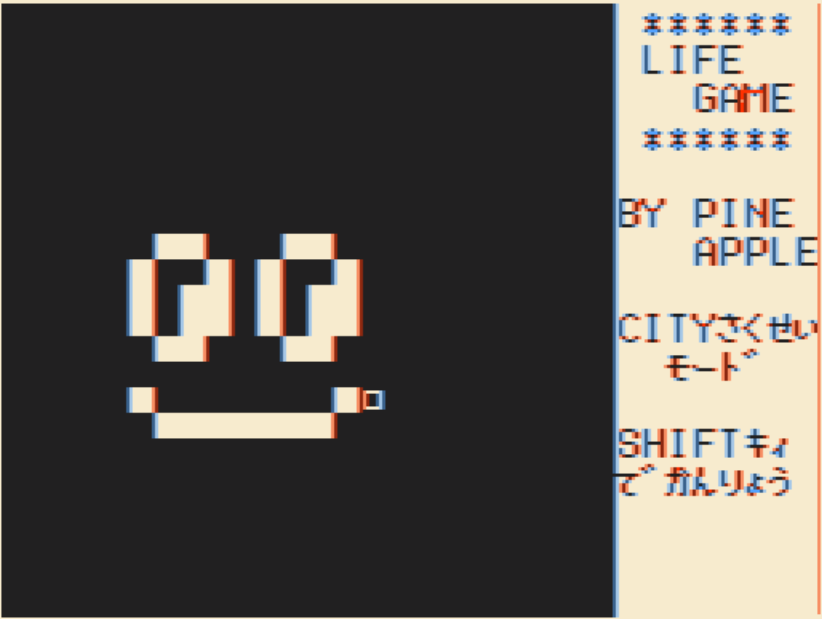
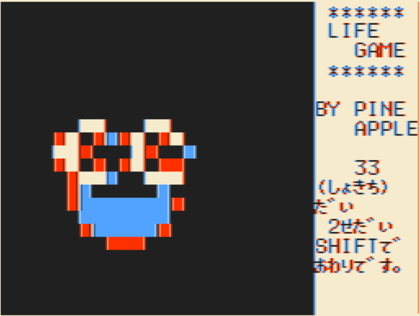
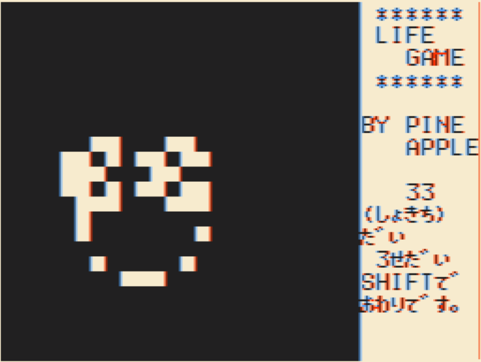
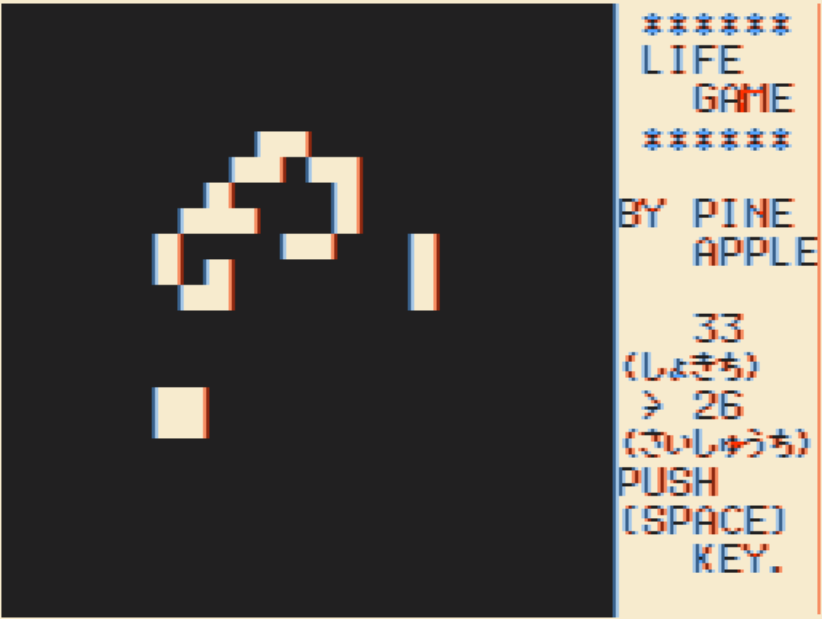

# LIFE GAME

## LIFE GAMEについて

LIFE GAMEとは、1970年に数学者のジョン・コンウェイさんが考えたゲームです。  
このゲームでは、たくさんの四角いマスがあって、それぞれのマスには「生きている」か「死んでいる」かの状態があります。ルールに従って、マスの状態が変わっていく様子を楽しむゲームです。

さらに詳しく知りたいときは、Wikipedia を見ていただくとサンプルなどもあり楽しそうなので、そちらのほうを見ていただいたほうが良いかと思われます。

https://ja.wikipedia.org/wiki/ライフゲーム

## 動画URL

https://youtu.be/Lbjn_EXe1oM

## 動作条件

- メモリは16KB/32KBどちらでもOKです。
- ページ数は2以上です

## プログラムの起動方法

プログラムは  
PC60_LIFEGAME_16k_p2_edit_44100.wav １つのみです。

起動までの手順はこんな感じ。（16KBの場合）

- カセットケーブルの白をwav再生デバイスと接続します
- PC6001実機を起動します
- How Many Pages? は2を指定してください
- ***CLOAD***コマンドを実行します
- wav再生デバイスで`PC60_LIFEGAME_16k_p2_edit_44100.wav`を再生します
  - `LIFE` という名前で読み込まれます
- ***RUN***コマンドでプログラムを実行します

### 操作方法

タイトル画面で 'HIT SPACE BAR.'と出ている時に`SPACE`キーを押すと、「CITYさくせいモード」になります。（'HIT SPACE BAR.' が出てない時は`SPACE`キー押しても反応しません^^;）

「CITYさくせいモード」では、カーソルキーで画面の四角（□）を動かして、`SPACE`キーで点を打ったり消したりします。これでライフゲームの初期画面を作成します。完成したら `SHIFT`キーを押し開始します。

開始されると、現在の世代の誕生（下画面：赤色）と死滅（下画面：水色）が計算され表示されます。

※実行環境により表示される色は異なります。

誕生が生存表示になり死滅が取り除かれて世代が１つ進みます。その状況が画面に反映されます。

このように世代がどんどん移り変わるさまを眺めます。`SPACE`キーを押してる間だけポーズ状態になります。`SHIFT`キーで結果表示となります。

