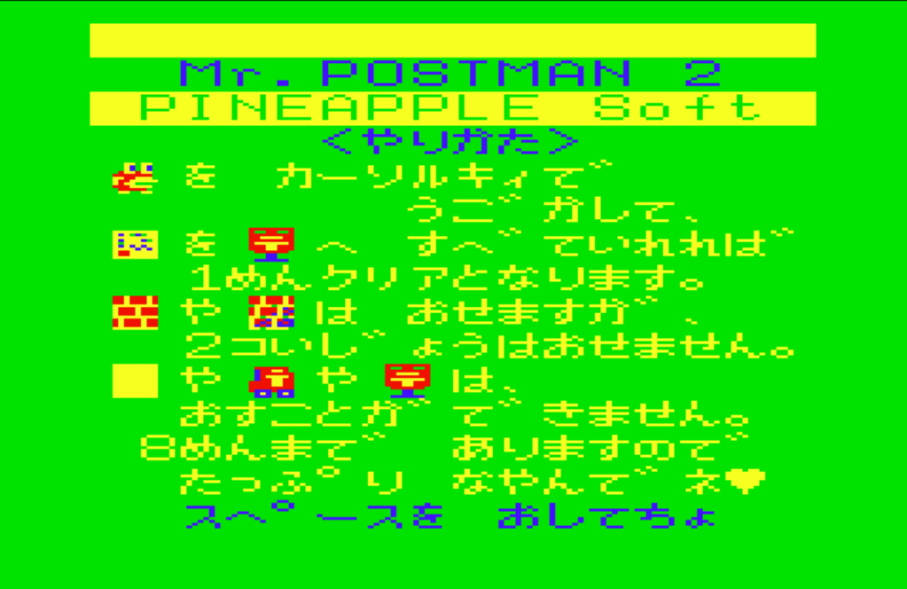
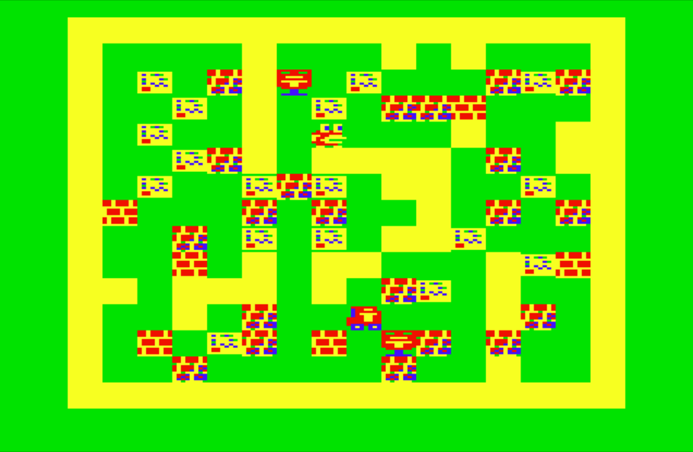

# Mr.POSTMAN2

## 動作条件

- メモリは16KBです。
- ページ数は2です

## プログラムの起動方法

プログラムは２つあります。  
１つ目（P6_MrPOSTMAN2_M.wav - POST2m）がマシン語部分で、  
２つ目（P6_MrPOSTMAN2_B_edit.wav - POST-2）がメインプログラムです。

起動までの手順はこんな感じ。

- カセットケーブルの白をwav再生デバイスと接続します
- PC6001実機を起動します
- How Many Pages? は2を指定してください
- ***CLOAD***コマンドを実行します
- wav再生デバイスで`P6_MrPOSTMAN_M.wav`を再生します
  - `POST2m` という名前で読み込まれます
- ***RUN***コマンドでプログラムを実行します
  - すぐに次のプログラム読み込みが開始されます
- wav再生デバイスで`P6_MrPOSTMAN_B_edit.wav`を再生します
  - `POST-2` という名前で読み込まれます
- ***RUN***コマンドでプログラムを実行します

### タイトル画面

タイトル画面で、しばらくすると  
「スペースを　おしてちょ」という表示が出ます。  
この時に`SPACE`キーを押すことでゲームが開始されます。

### ゲームの説明

ポストマンを操作し、画面のあちこちにある郵便物をポストに全部押し入れるとクリアになるパズルゲームです。
ステージは全部で８つあります。

ルール：

- 画面のあちこちにある郵便物を全てポストに押し入れるとクリア。
- 郵便物は押して移動することが出来ます。
- ブロックには押せるものと押せないものがあります。
  押せるものでも２つ以上同時には押すことが出来ません。
- ブロックや郵便物を引っ張ることは出来ません。

