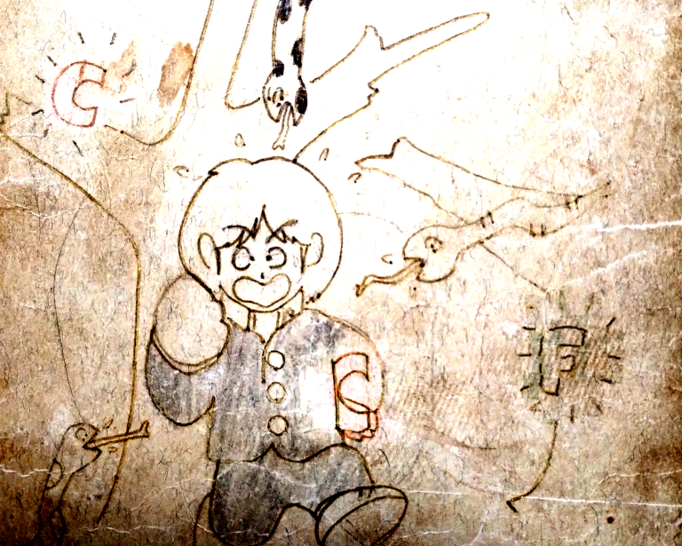
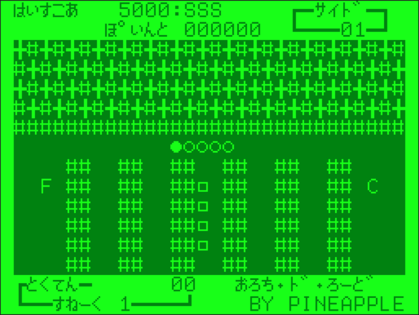
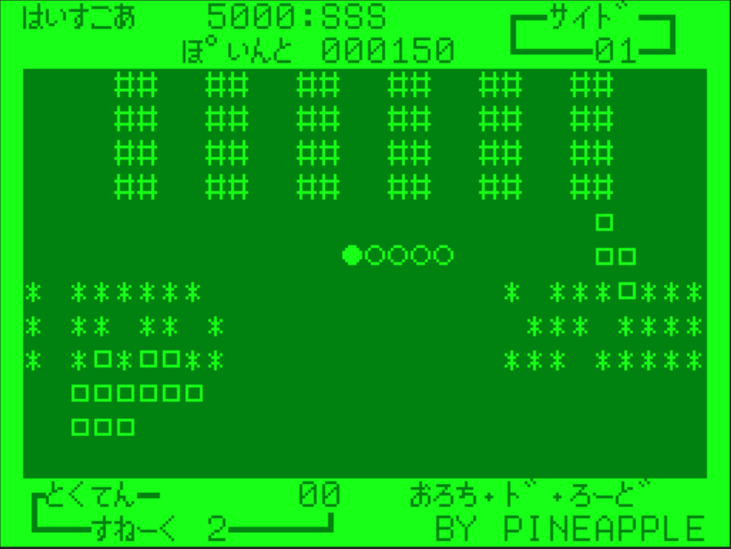

# おろち・ド・ロード

## 動作条件

- メモリは***必ず 16KB***にしてください
- ページ数は2です

## プログラムの起動方法

プログラムは２つあります。  
１つ目（PC6001_PS2_SNK_M.wav - SNK/M）がマシン語部分で、  
２つ目（PC6001_PS2_SNAKE_edit.wav - SNAKE）がメインプログラムです。

起動までの手順はこんな感じ。

- カセットケーブルの白をwav再生デバイスと接続します
- PC6001実機を起動します
- How Many Pages? は2を指定してください
- ***CLOAD***コマンドを実行します
- wav再生デバイスで`PC6001_PS2_SNK_M.WAV`を再生します
  - `SNK/M` という名前で読み込まれます
- ***RUN***コマンドでプログラムを実行します
  - すぐに次のプログラム読み込みが開始されます
- wav再生デバイスで`PC6001_PS2_SNAKE_edit.wav`を再生します
  - `SNAKE` という名前で読み込まれます
- ***RUN***コマンドでプログラムを実行します

## 起動～タイトル

RUNするとするとタイトル画面とランキング画面が交互に表示されます。  
RETURNキーを押すとゲームが始まります。

### あそびかた

画面中央あたりにいるヘビ'●〇〇〇〇'をカーソルキーで８方向移動させ、  
敵のヘビ'□□□□'に当たらないようにして  
プレイエリア内にあるチェックポイント'Ｃ'を取っていきます。（１つ50点）  
SPACEキーを押すと自分のヘビの向きが反転します。  
プレイエリア内にあるファストポイント'Ｆ'を取ると、
全体の速度が少し上がって、エサの点数が倍になります。

'＃'は壁で、通れません。  
'＊'は草むらで、通れます。通ると草むらは消えます。
また、敵は草むらを通れません。これを利用して敵をはめることが出来ます。

全てのチェックポイント'Ｃ'を取るとサイドクリアとなります。

