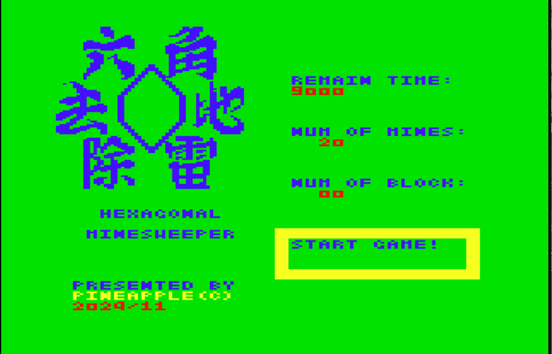
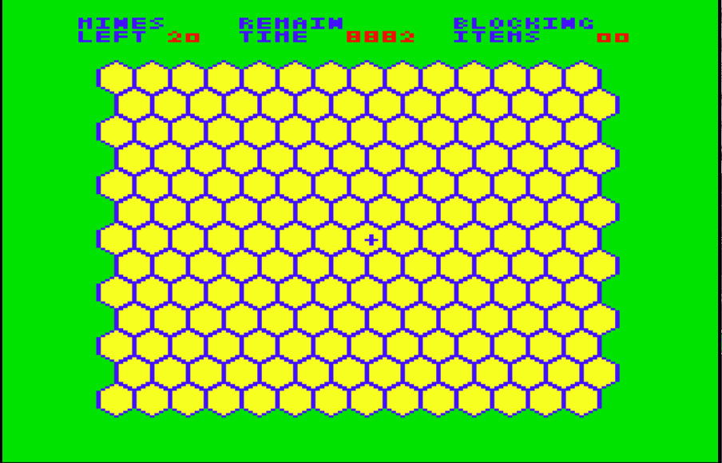
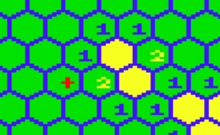
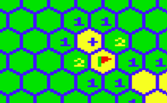
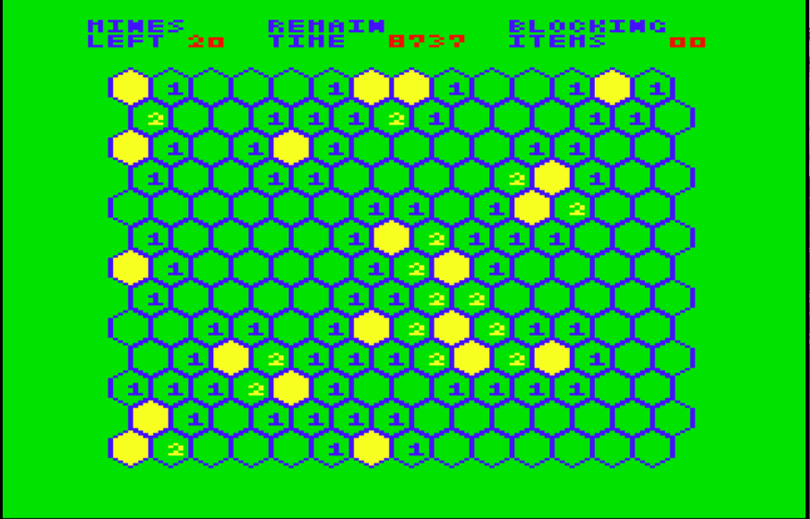
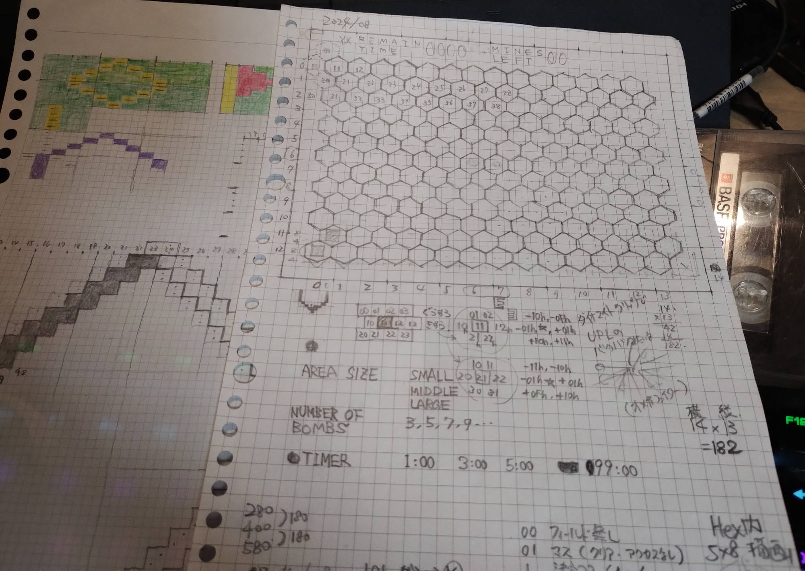
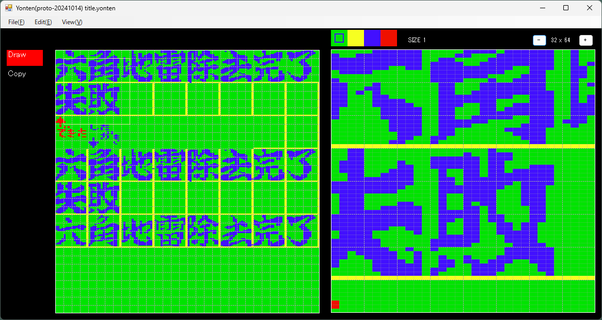
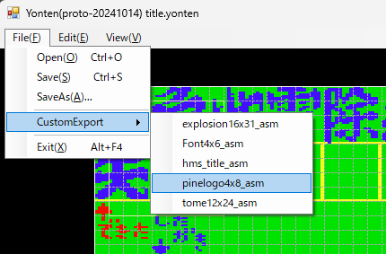

# 六角地雷除去<br/>HEXAGONAL MINESWEEPER

- [六角地雷除去HEXAGONAL MINESWEEPER](#六角地雷除去hexagonal-minesweeper)
	- [ざっくりなストーリー](#ざっくりなストーリー)
	- [動作条件](#動作条件)
	- [プログラムの起動方法](#プログラムの起動方法)
	- [操作方法とかルールとか](#操作方法とかルールとか)
		- [タイトル画面](#タイトル画面)
		- [ルール](#ルール)
	- [開発振り返り](#開発振り返り)
		- [8月](#8月)
		- [9月-10月](#9月-10月)
		- [11月](#11月)


## ざっくりなストーリー

おいらは爆弾処理班。  
六角マスのどっかに埋まってる地雷処理を任された。  
秘密兵器の地雷爆発抑止とともに  
全ての地雷を取り出して、  
平和なここらへんを取り戻そう！

## 動作条件

- メモリは32KBでお願いします。
- ページ数は2でお願いします。


## プログラムの起動方法

起動までの手順はこんな感じです。

- カセットケーブルの白をwav再生デバイスと接続します
- PC6001（無印）実機にROMRAMカートリッジを挿して起動します<br/>（mkII以降はよくわからないのでうまいことやってください😅）
- 起動すると、How Many Pages? と出るので、<br/> `2`キーを押して、`RETURN`キーを押してください。
- `CLOAD`と打ち込み `RETURN`キーを押して、***CLOAD***コマンドを実行します
- wav再生デバイスで`P6_HMS_32k_p2.WAV`を再生します
  - `HMS322` という名前で読み込まれます
- `RUN`と打ち込み `RETURN`キーを押して、***RUN***コマンドを実行します


## 操作方法とかルールとか

### タイトル画面

起動すると、PINEAPPLEロゴが表示されその後タイトル画面が表示されます。



ここでカーソルキーで以下の設定を変更することが出来ます。

- REMAIN TIME : 制限時間（9000,2400,1200,200）
- NUM OF MINES: 地雷の数（20,30,40,70）
- NUM OF BLOCK: 地雷抑止の数（0,1,5,10）

カーソルキーの上下で項目を選び、左右で値を変更します。  
項目を START GAME! にしてスパースを押すとゲーム開始となります。

### ルール

マイクロソフトのマインスウィーパーとほぼ同じです。  
こちらのほうはプレイフィールドが六角形を敷き詰めた感じになってます。



最初はすべてのマスがクローズの状態（黄色マス）になっています。  
中央部分にある十字カーソルを操作してマスをオープンしていきます。

```
使うキー
- カーソル キー：十字カーソルを移動する
- [SPACE] キー：十字カーソル位置のマスをオープンする
- [SHIFT] キー：十字カーソル位置のマスに旗、？などを設置・消去する
- [ESC]   キー：ゲームを終了メニューを出す
```

オープンしたマスに地雷が埋まっていたら、その地雷が爆発しゲームオーバーとなります。また、制限時間が無くなるとゲームオーバーとなります。

オープンしたマスの周囲６マスに１つ以上地雷がある場合は、いくつ地雷が埋まっているかが表示されます。オープンしたマスの周囲に１つも地雷が埋まっていない場合は、周囲６つのマスもオープンされます。



「お、このマスに地雷ありそうだな…」と思ったとき、旗を立てて目印にすることが出来ます。旗を立てたいマスに十字カーソルを移動し、１回 `SHIFT`キーで配置します。もう一度`SHIFT`キーを押すと「？」が配置されます。これは「爆弾かも…？」みたいなわからない時に立てておきたい場合に使ってみてください。もう一度`SHIFT`キーで消去します。



制限時間内に地雷マスを除いた全てのマスをオープンするとクリアです。  




## 開発振り返り

マインスウィーパー、ちょっとイライラさせられるけど、楽しいっすよね。  
「これ６角形のマスでやったらどうなるんかいな？」と思って作り始めました。  

何年振りかもう覚えてないぐらい久しぶりのPC6001のプログラミングなので、まあ、テキトーにリハビリって感じで作ってみようと…。やっぱりZ80は楽しいっすね！👍

アセンブラは、AILightさんの [AILZ80ASM](https://github.com/AILight/AILZ80ASM) を使わせていただきました。  
ありがとうございます🙇‍♂️

ざっくり、８月ぐらいに開始して９月か１０月ぐらいに完成させたいなと思ってました。

### 8月

結局、８月は「どんな画面にしようかなあ？」と悩んでいたり、小さな機能をちまちまと作っていてそれで終わっちゃいました。



この紙見ると…  
最初は「エリアサイズを選べるといいなあ」とか思ってたんだけど、プレイしてみたら14マス x 13マス以下だと小さすぎということが判明し廃止になりました。あと、制限時間が秒数指定だったんだけど、めんどくさそう…😅…だったのでやめになりました。あと地雷の爆発が「UPLのバクハツみたいな（オメガファイター）」と書いてあるけど、これもやめてます。

(*)開発スタイルがまだ80年代？

### 9月-10月

９月と１０月はゲームメインのところを組み始めて、とりあえずゲームが出来るようになりました。サウンド機能もちょこっとずつ実装していってた感じです。タイトルの漢字のグラフィックデータとかも書いたりして。

今回、グラフィックデータについては、YontenというSCREEN3ツールを用意して、そいつで作ったりしてました。



機能は超ヘボいですが、jsonでどんな感じに吐き出すのかを指定できるカスタムエクスポートという機能は便利でした。アセンブラのソースとして出力されます。



jsonファイルはこんな感じ。

```json
{
	"Name": "hms_title_asm",
	"ImagePacs": [
		{
			"Name": "title_logo",
			"Width": 16,
			"Height": 31,
			"Locates": [
				{ "X":   0, "Y": 0 },
				{ "X":  16, "Y": 0 },
				{ "X":  32, "Y": 0 },
				{ "X":  48, "Y": 0 },
				{ "X":  64, "Y": 0 },
				{ "X":  80, "Y": 0 },
				{ "X":  96, "Y": 0 },
				{ "X": 112, "Y": 0 },
				{ "X":   0, "Y": 32 },
				{ "X":  16, "Y": 32 }
			]
		}
	]
}
```

出力されるアセンブラソースはこんな感じ。

```
; --------
; title_logo
; --------
; Locate(0,0)
		DB	00H,2AH,00H,00H
		DB	00H,2AH,00H,00H
			:
		DB	80H,00H,00H,A0H
		DB	80H,00H,02H,80H
; Locate(16,0)
		DB	00H,28H,A8H,00H
		DB	00H,2AH,A8H,00H
			:
```


### 11月

１１月はタイトル画面を整えたり、とかPINEAPPLEロゴを表示したりをやってました。  
あと、マインスウィーパーってパズルだけど、地雷のヒントが全く無くて運ゲーっぽくなる時があって、それの救済策としてなんか出来ないかな？と思い、地雷爆発抑止を追加実装していました。

なお wav化には、TINY野郎さんの [なんでもピーガーmkII](https://www.tiny-yarou.com/datarec.html) を使わせていただきました。  
ありがとうございます。🙇‍♂️


