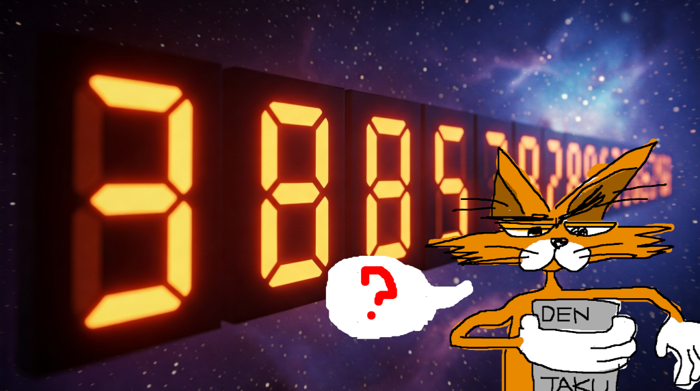
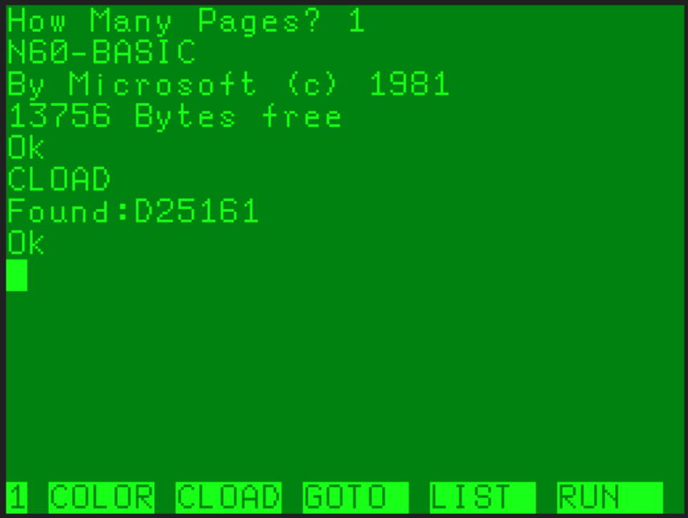
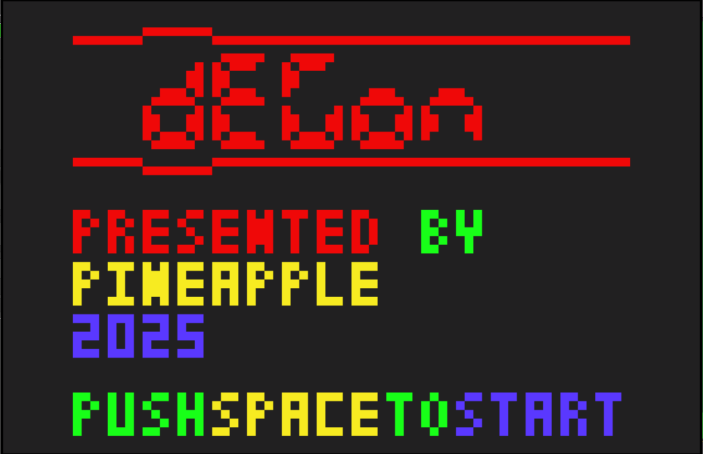
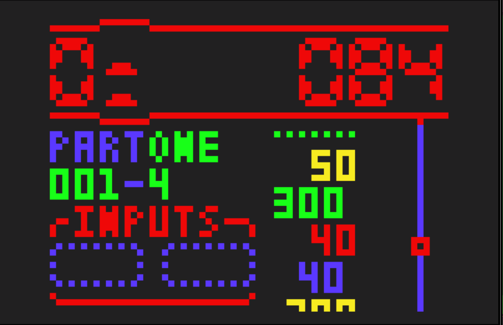
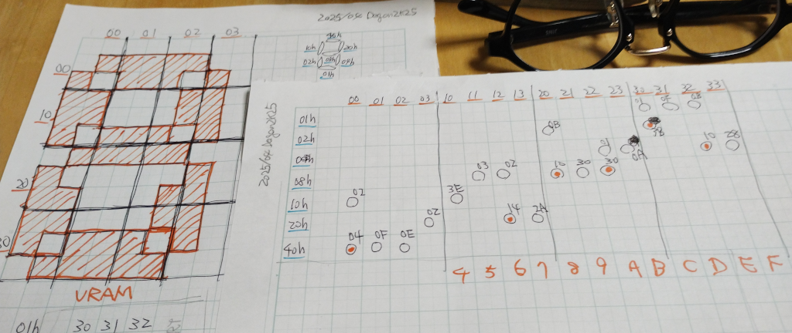

# DEGON 2K25

- [DEGON 2K25](#degon-2k25)
	- [Brief Story](#brief-story)
	- [Video URL](#video-url)
	- [Operating Requirements](#operating-requirements)
	- [How to Start the Program](#how-to-start-the-program)
	- [Controls and Rules](#controls-and-rules)
		- [Title Screen](#title-screen)
		- [Quick Rules](#quick-rules)
	- [Chat](#chat)

## Brief Story

Captain: "Aliens are attacking from space!"
Subordinate: "Out of the blue, huh?"
Captain: "The enemies are in the shape of numbers!"
Subordinate: "What do you mean?"
Captain: "You can defeat them with missiles shaped like the same numbers!"
Subordinate: "Did we even have missiles like that?"
Captain: "If the sum of the numbers you add up is divisible by 10, a UFO will appear!"
Subordinate: "Will UFOs appear? Are the aliens invading on foot, anyway?"
Captain: "Annihilate the aliens before we're invaded!"
Subordinate: "I'll go do that for now."

## Video URL

https://youtu.be/

## Operating Requirements

- 16KB of memory is required.
- 1 page is required.

## How to Start the Program

The startup procedure is as follows:

- Connect the white cassette cable to the wav playback device.
- Start the PC6001 (original).
- When it starts, it will display "How Many Pages?", so press the `1` key and then press the `RETURN` key.
- Type `CLOAD` and press the `RETURN` key to execute the `CLOAD` command.
- Play `P6_D2K_16k_p1.WAV` on the wav playback device.
  - It will be loaded with the name `D25161` 
- Type `RUN` and press the `RETURN` key to execute the `RUN` command.

## Controls and Rules

### Title Screen

When you start the game, the PINEAPPLE logo will be displayed, followed by the title screen.

Press the [SPACE] key to start the game.

### Quick Rules

Number groups will attack from the right side of the screen.

Match the number of the attacking enemies with the number of the aiming device using the aiming button ([<-] key), and shoot down the numbers with the firing button ([->] key).

When the sum of the defeated numbers is divisible by 10, a 300-point UFO will appear.

The further away (to the right) you shoot down an attacking number, the higher the score.

Clearing all the numbers will clear the pattern.
With each clear, the speed of the attacking numbers increases.

The game is over if you are invaded 3 times in one stage.

## Chat

This game was originally for a CASIO game calculator, and I ported it to the X68000 in 1990 and released it as DEGON.

I thought, "Why not make a PC6001 version?" so I prepared a repository on April 15th and spent about two weeks creating it.

It feels quite different from the X68000 version.

The development speed has increased compared to the previous "Hexagonal Minesweeper."
Last time, I was kind of preparing the PS6024 library while coding, but this time I used that library, so it was relatively easy.
The screen is screen 2, and the game rules are simple, too.

I was a bit out of work, so I used that time for it... 😱
(Retro jobs are welcome! 😅)

The "interesting!" point in this development is the 7-segment display.
Well, I'll write about that in a separate document when I feel like it.

