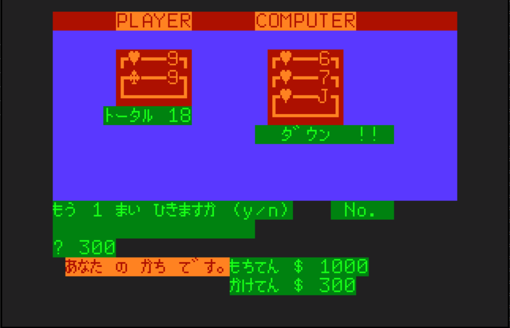
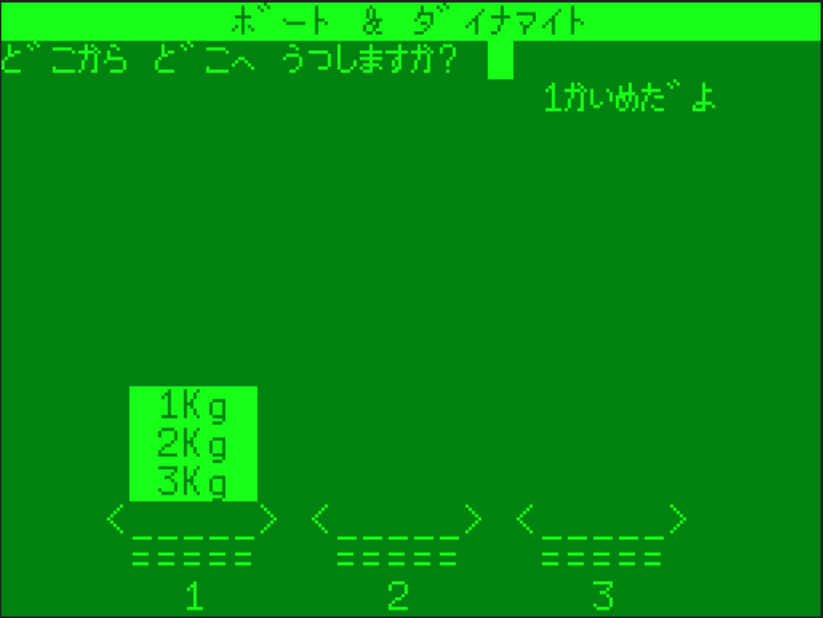
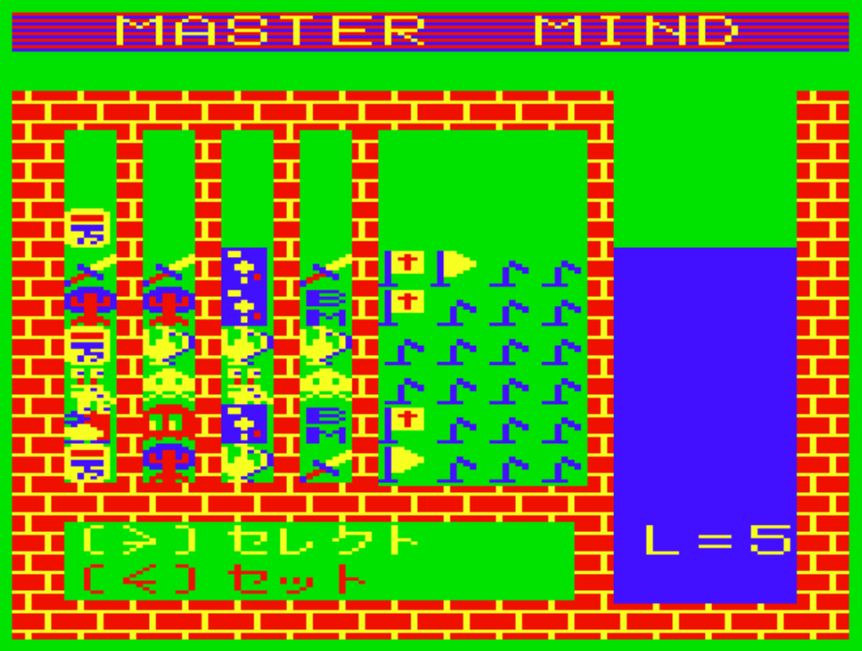
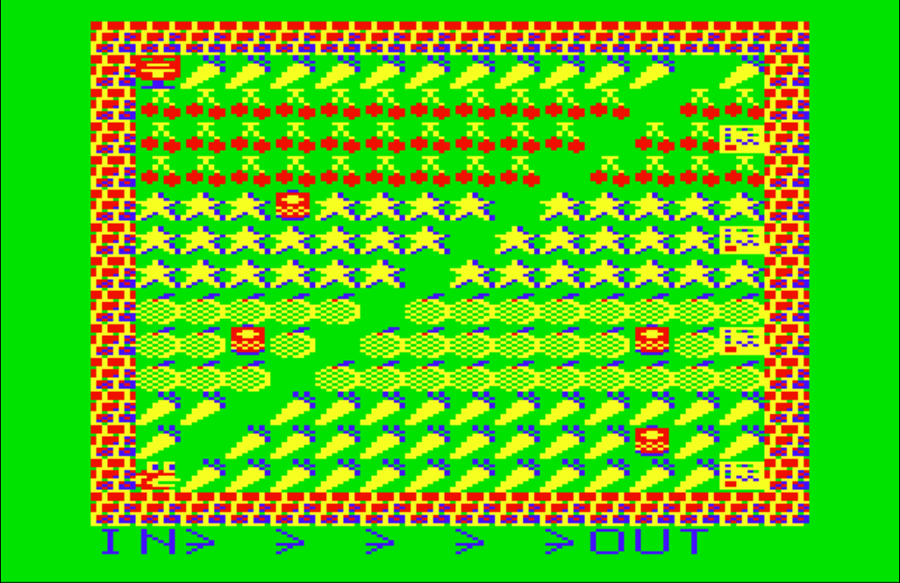
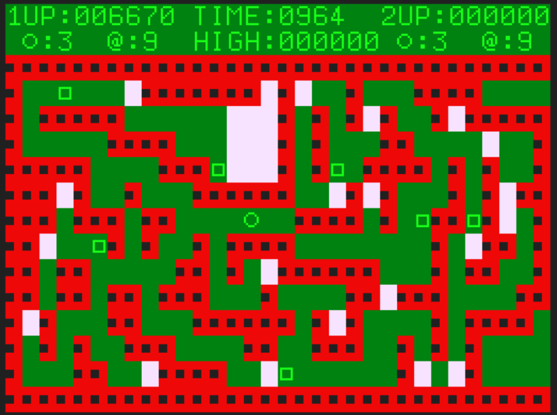
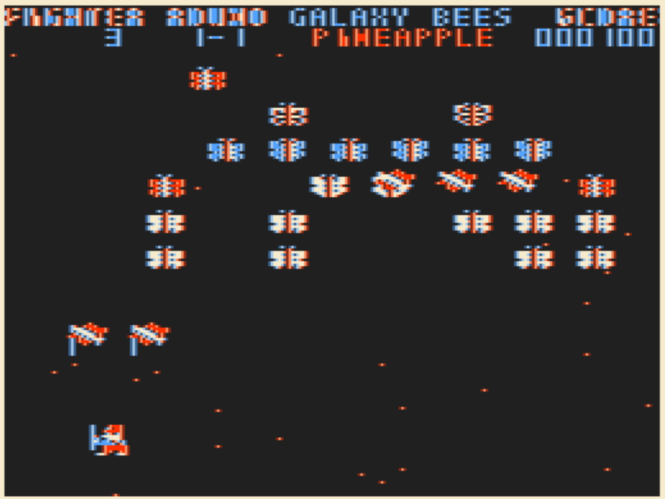

# PC6001-programs

昔作ったPC6001用のプログラムを置いてあります。 
カセットで読み込むためのwavファイルを置いておく予定です。 
良かったらダウンロードして遊んでみてください。\^-\^ 

There is a program for the PC6001 that I made a long time ago. 
I plan to put a wav file to read in the cassette. 
Please download and play if you like.　:) 

## プログラム

### 1983年

[LASVEGAS JACK](1983/LasvegasJack/README.md)

### 1984年

[ボートアンドダイナマイト](1984/BoatAndDynamite/README.md)

[マスターマインド](1984/MasterMind/README.md)

### 1985年

[Mr.POSTMAN](1985/MrPOSTMAN/README.md)

[Mr.POSTMAN2](1985/MrPOSTMAN2/README.md)

[RANGER](1985/Ranger/README.md)

[おろち・ど・ろーど](1985/Snake/README.md)

[GALAXY BEES](1985/GALAXYBEES/README.md)

### 2024年

[六角地雷除去 HEXAGONAL MINESWEEPER](2024/HexagonalMineSweeper/README_jp.md)

### 2025年

[DEGON 2K25](2025/DEGON2K25/README_jp.md)

